# Trime 主题工坊

面向同文输入法（Trime）的主题工具集，包含一个浏览器主题编辑器和一个 Android 动态配色 App。

[在线使用主题工坊](https://lanlanderui.github.io/trime-theme-studio/) · [下载 Android APK 与示例主题](https://github.com/lanlanderui/trime-theme-studio/releases) · [查看同文输入法](https://github.com/osfans/trime)

  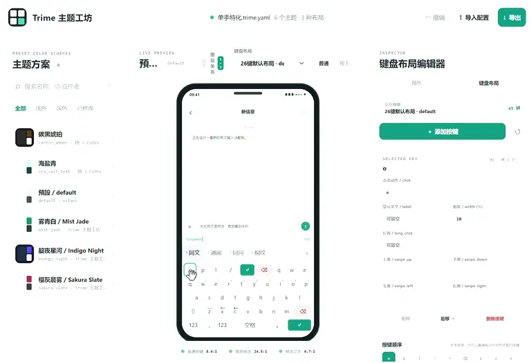

## 主要功能

### 网页主题工坊

- 导入任意 `.trime.yaml`，实时预览并编辑配色。
- 可视化调整按键顺序、宽度、点击、长按和滑动动作。
- 导出完整主题文件，保留原有布局、注释和其他配置。
- 纯前端运行，可在线使用，也可下载后离线打开；配置不会上传到服务器。

### Android 动态配色 App

- 读取 Android 12+ 的 Material You 动态颜色，自动生成同文浅色和深色主题。
- 支持手动指定主色，其余颜色自动补全。
- 自由选择 Rime 目录中的主题 YAML，一键写入、备份和撤销。
- 可永久收藏喜欢的配色，不会被下一次动态配色更新覆盖。
- 内置轻量配色方案管理器，可批量重命名或删除已有方案，最后统一保存和部署。
- 可一键写入“更新配色”和“收藏配色”快捷键，在同文键盘中直接调用。
- 无网络权限，无需申请整个存储空间的访问权限。

## 网页主题工坊展示

<table>
  <tr>
    <td align="center">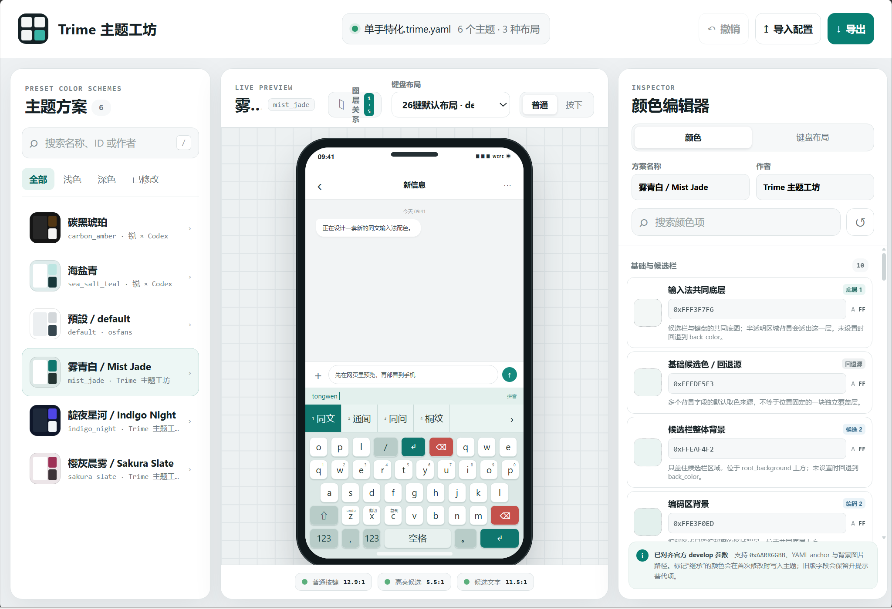 配色编辑与实时预览</td>
    <td align="center">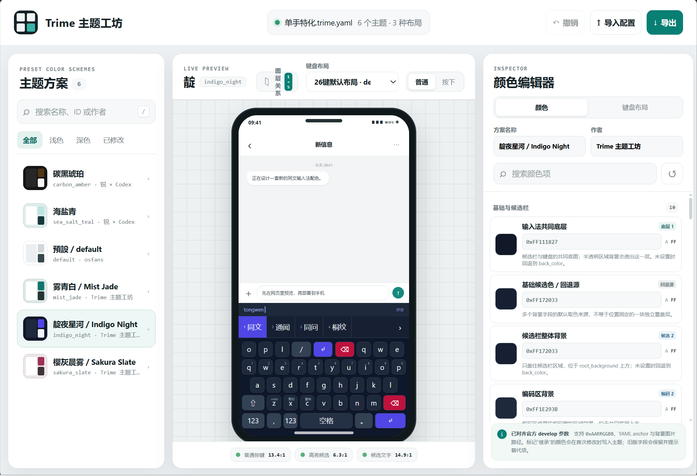 内置主题方案切换</td>
  </tr>
</table>

  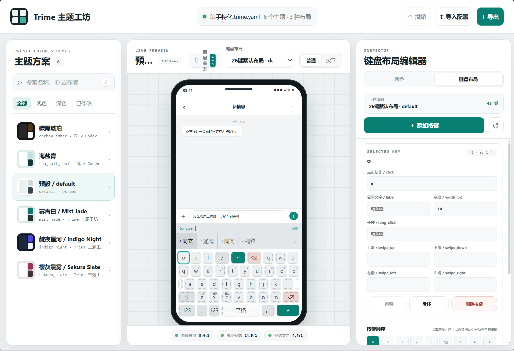 
  按键布局可视化编辑

## Android App 展示

<table>
  <tr>
    <td align="center" width="50%">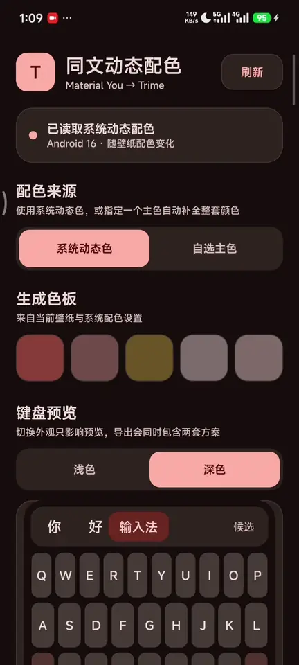 选择配色并一键写入</td>
    <td align="center" width="50%">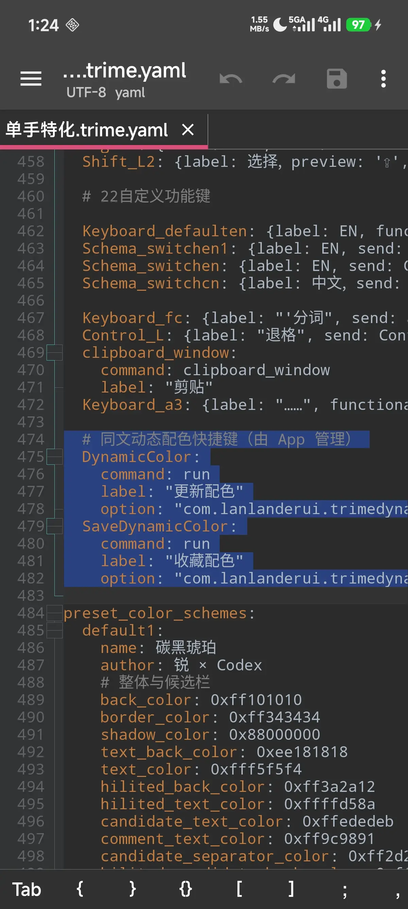 一键写入同文快捷键</td>
  </tr>
</table>

  
查看完整 App 界面截图

  
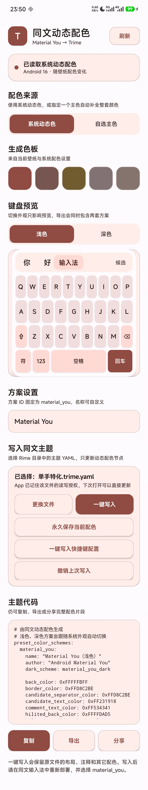

## 实际配色效果

<table>
  <tr>
    <td align="center">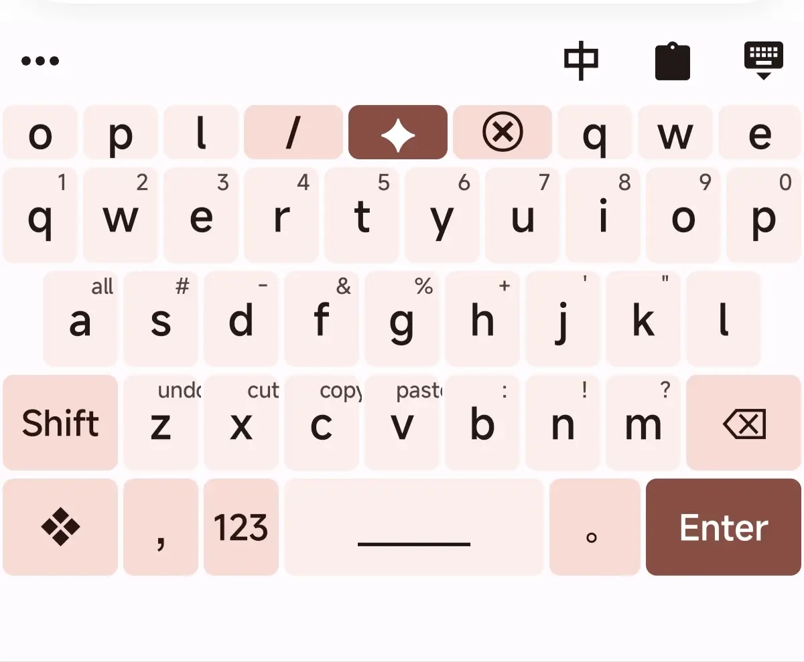 Android 动态颜色</td>
    <td align="center">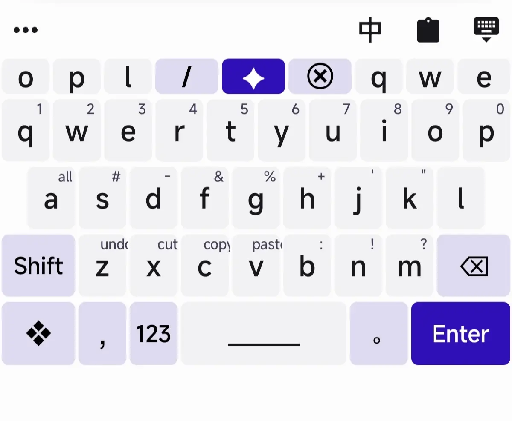 自定义主色系</td>
  </tr>
  <tr>
    <td align="center">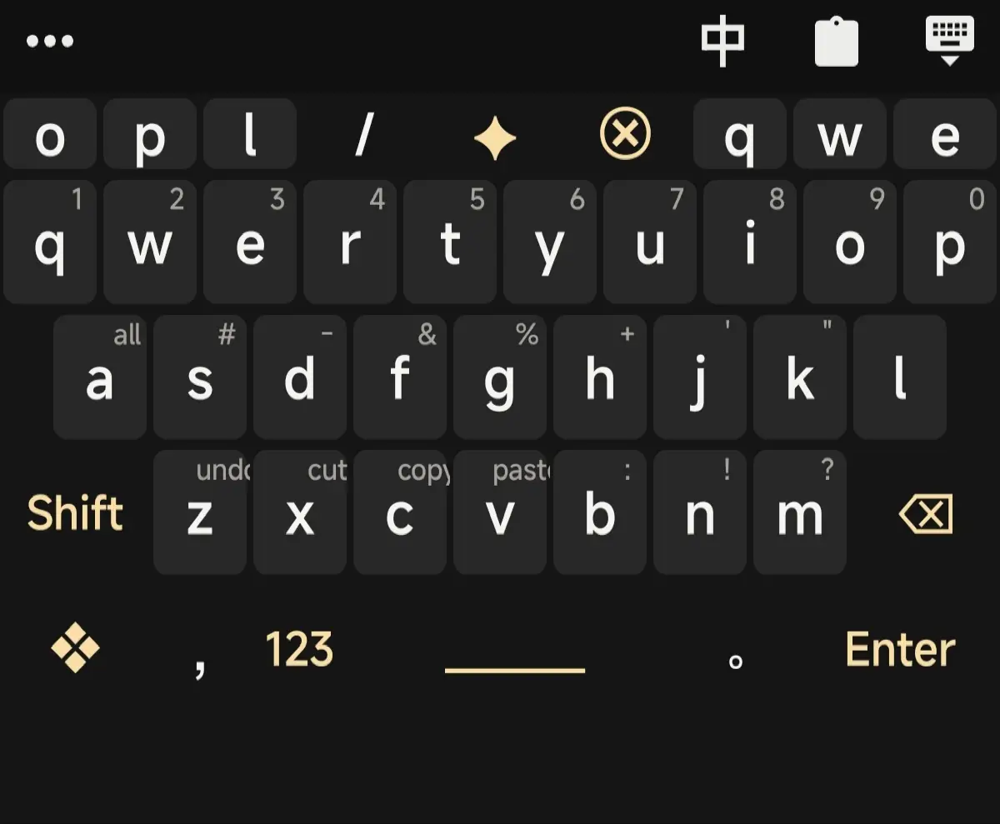 实际使用效果</td>
    <td align="center">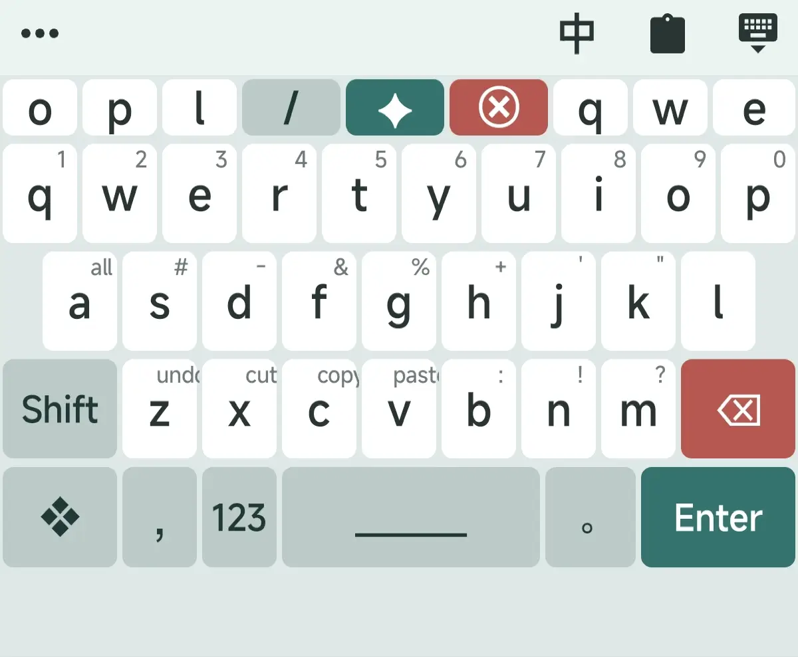 实际使用效果</td>
  </tr>
</table>

## 使用方法

### 使用网页主题工坊

1. 打开[在线版](https://lanlanderui.github.io/trime-theme-studio/)，或下载项目后双击 `index.html`。
2. 拖入自己的 `.trime.yaml`，选择需要修改的主题。
3. 调整配色或按键布局，并在中间区域实时预览。
4. 点击“导出”，将生成的主题文件放回 Rime 目录并重新部署。

### 使用 Android 动态配色

1. 从 [GitHub Releases](https://github.com/lanlanderui/trime-theme-studio/releases) 下载并安装 APK。
2. 在 App 中选择同文主题 YAML，再选择“系统动态色”或“自选主色”。
3. 点击“一键写入”，回到同文输入法重新部署即可。
4. 如需从键盘直接更新或收藏配色，再点击“一键写入快捷键配置”，并把对应快捷键绑定到需要的键位。

## 本地构建

- 网页版无需构建，直接打开根目录的 `index.html`。
- Android 版使用 Android Studio 打开 [`android`](android/) 目录，详细说明见 [`android/README.md`](android/README.md)。

## 许可

项目代码采用 [MIT License](LICENSE)。Trime 及配置模板中的第三方内容遵循其各自的许可与版权声明。
