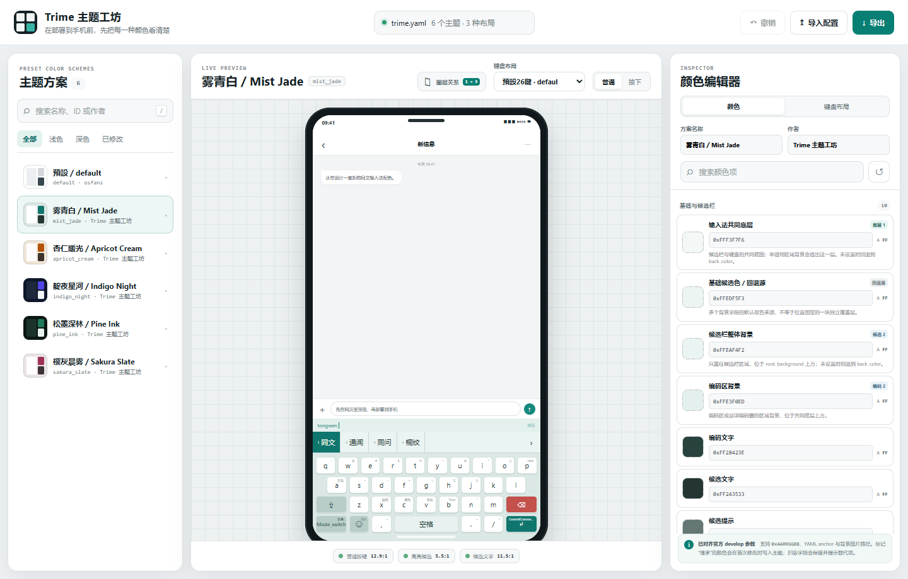
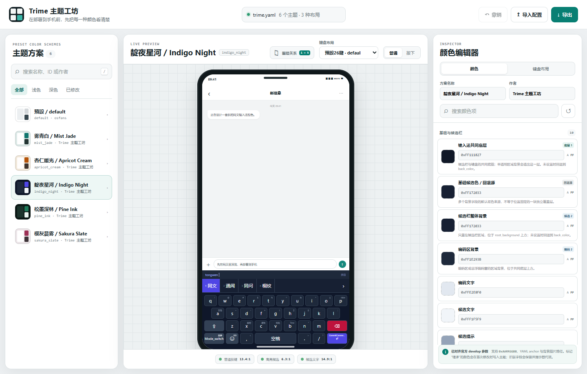
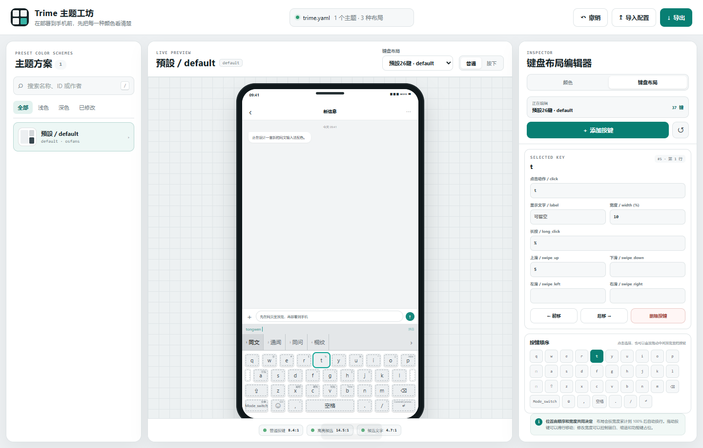

# Trime 主题工坊 & 同文动态取色app

## 省流介绍
> 项目说明：本项目由 **lanlanderui** 提出需求并提供初始 Trime 配置模板，界面设计、功能开发、官方参数整理、自动化测试与项目文档由 **OpenAI Codex** 完成。

主题工坊
点击进入：[Trime 主题工坊在线版](https://lanlanderui.github.io/trime-theme-studio/)
功能1: 自定义颜色
按键可以自己选颜色, 同时也内置了一些配色方案
<table>
  <tr>
    <th>雾青白／Mist Jade</th>
    <th>靛夜星河／Indigo Night</th>
  </tr>
  <tr>
    <td></td>
    <td></td>
  </tr>
</table>

功能2: 自定义键盘布局
可以直接鼠标拖动按键来调整布局, 可以增删按键,可以为每个按键设置宽度, 长按动作,上下左右滑动动作



## 在线使用

点击进入：[Trime 主题工坊在线版](https://lanlanderui.github.io/trime-theme-studio/)

在线版直接在浏览器中运行，不需要安装，也不会把载入的 YAML 配置上传到服务器；文件解析、预览、修改和导出均在当前浏览器页面内完成。


## 功能

- 读取和筛选 `preset_color_schemes` 主题方案。
- 以 `单手特化.trime.yaml` 作为内置模板，包含单手键盘布局及碳黑琥珀、海盐青、雾青白、靛夜星河、樱灰晨雾 5 套原创配色。
- 实时预览候选栏、键盘、按键按下及弹出层配色。
- 内置“图层关系”图解，按候选栏、键盘和编码区分支展示由底到顶的颜色覆盖顺序。
- 编辑官方颜色字段，兼容 `0xAARRGGBB`、YAML anchor 与背景图片路径。
- 新增、删除、拖动和调整按键宽度，编辑点击、长按与四向滑动动作。
- 支持撤销、重置，并导出保留其余配置内容的完整 `.trime.yaml`。

## 内置主题预览

<table>
  <tr>
    <th>雾青白／Mist Jade</th>
    <th>靛夜星河／Indigo Night</th>
  </tr>
  <tr>
    <td></td>
    <td></td>
  </tr>
</table>

两张预览均展示了切换键、空格键、回车键和退格键与普通字符键的颜色区分。其余内置方案可在主题列表中直接切换查看。

## 使用

1. 双击 `index.html`。
2. 从左侧选择 `preset_color_schemes` 中的主题。
3. 在右侧点击色块或输入 `0xAARRGGBB` 调色；中间键盘会实时更新。
4. 切换到“键盘布局”后，可以在中间预览中点击或拖动按键；右侧支持新增、删除、前后移动，并可编辑 `click`、`label`、`width`、`long_click` 和四向滑动动作。
5. 点击右上角“导出”，下载保留其余配置与注释的完整 `.trime.yaml`。

布局按 Trime 的宽度规则实时换行：每行累计到约 100% 后进入下一行。因此调整顺序决定按键先后位置，调整 `width` 决定占位宽度。完整配置导出会写入布局修改；“复制当前主题 YAML”和“下载当前主题片段”只包含配色方案。

内置键盘会读取每套主题的功能键色：`bgn/tgn` 用于切换类按键，`bkg/tkg` 用于空格键，`benter/tenter` 用于回车键，`bbs/tbs` 用于退格键。四类功能键均与普通字符键区分，并分别保持可读的文字对比度。

网页预置了同目录的 `单手特化.trime.yaml`。也可以把任意 UTF-8 编码的 `.trime.yaml` 拖到网页中临时载入，网页不会直接改写源文件。`trime.yaml` 与 `tongwenfeng.trime.yaml` 保留在目录中作为备用模板。

如果手动更新了同目录的 `单手特化.trime.yaml`，运行下面的命令可以更新网页内置副本：

```powershell
node build-bundled-config.mjs
```

也可以临时指定其他模板，例如：

```powershell
node build-bundled-config.mjs tongwenfeng.trime.yaml
```

项目没有在线依赖，断网也能使用。

## Android 动态配色 App

仓库的 [`android`](android/) 目录包含一个独立的原生 App，用于把 Android 12+ 的 Material You 系统动态配色转换为同文输入法主题代码。它不是网页编辑器的 WebView 封装，界面、取色、预览和导出均由 Android 原生实现。

- 自动读取壁纸生成的系统动态色板。
- 支持指定一个主色，自动生成协调的浅色、深色与功能键配色。
- 同时生成浅色 `material_you` 与深色 `material_you_dark`，并配置自动切换关系。
- 可从 Rime 目录选择现有主题 YAML 并一键安全写入，原布局、注释和其它配色会被保留。
- 可把当前配色永久追加为独立收藏方案，之后更新动态色不会覆盖。
- 写入前自动保存最近备份，支持在 App 内撤销。
- 提供同文键盘可直接调用的 `QuickApplyActivity`，按当前配色来源一键写入并请求重新部署。
- 提供 `QuickSaveActivity`，可从同文按键直接把当前配色永久收藏为独立方案。
- 可一键将更新与收藏两个快捷键定义合并到主题的 `preset_keys`，无需手动复制粘贴。
- 提供键盘预览、方案名编辑、一键复制、分享和 `.yaml` 文件导出。
- 无网络权限、无存储权限；Android 11 及以下会使用内置备用配色。

用 Android Studio 打开 `android/` 目录即可构建，详细说明见 [`android/README.md`](android/README.md)。

面向普通用户的签名 APK 与“单手特化”个人主题方案会随版本发布到 [GitHub Releases](https://github.com/lanlanderui/trime-theme-studio/releases)，无需从 Actions 中查找临时构建产物。

## GitHub Pages 发布方式

本项目是纯静态网页，入口文件为仓库根目录的 `index.html`，不需要后端服务器和构建步骤。仓库使用 GitHub Pages 的 **Deploy from a branch** 模式，将 `main` 分支的 `/ (root)` 目录作为网站来源。GitHub 会自动把 HTML、CSS、JavaScript 和内置模板发布到：

```text
https://lanlanderui.github.io/trime-theme-studio/
```

以后向 `main` 分支推送更新时，GitHub Pages 会自动重新部署，通常等待片刻后在线版就会更新。

## 相关项目与文档

- [Trime（同文输入法）](https://github.com/osfans/trime)
- [Trime 主题配置文档](https://github.com/osfans/trime/wiki/Theme-Configuration-(New))

## 颜色字段兼容性

颜色编辑器依据 Trime `develop` 分支的内置 fallback 清单维护。当前按键弹出层使用：

- `popup_back_color`
- `popup_text_color`
- `hilited_popup_back_color`
- `hilited_popup_text_color`

旧配置中的 `preview_back_color`、`preview_text_color` 会继续显示，但会标记为已废弃并提示新的替代字段。`root_background`、`candidate_background`、`keyboard_back_color` 等背景项也支持直接保留图片路径。

预览按 Trime 的区域覆盖关系绘制：`root_background` 是候选栏与键盘的共同最底层；其上分别覆盖候选栏的 `candidate_background` 和键盘区的 `keyboard_back_color`，再往上才是高亮候选、按键状态、文字与按键提示浮层。`back_color` 主要是多个字段的默认回退源，不应理解为位置固定的额外图层。当前官方 schema 没有 `keyboard_background`，键盘区域请使用 `keyboard_back_color`。

## 许可

本项目代码采用 [MIT License](LICENSE)。Trime 及配置模板中属于第三方的内容仍遵循其各自原有的许可和版权声明。
